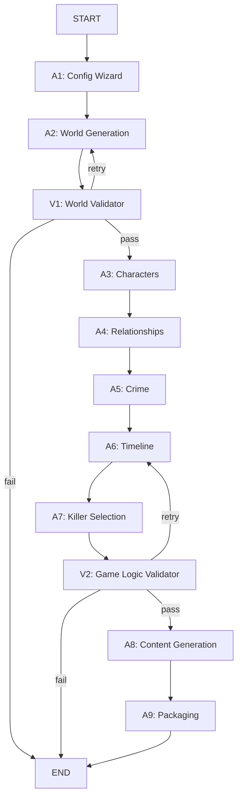

# Mystery Agents

AI-powered mystery party game generator using LangGraph and LangChain.

## Overview

Mystery Agents is a multi-agent system that generates complete mystery party games in the style of Cluedo and Knives Out. The system uses LangGraph for workflow orchestration and LangChain for LLM integration, creating coherent, playable mystery scenarios with characters, clues, and guided gameplay.

**📖 [Read about the Game Experience](game_experience.md)** - Learn what playing a generated mystery party is like

## Features

- **Complete Game Generation**: Generates all materials needed for a live-action mystery party
- **Host-Detective Mode**: Host plays as victim in Act 1, then becomes detective in Act 2
- **Act 1 Objectives**: Each player receives 2-3 specific, actionable goals that create social tension and roleplay opportunities during the party
- **Automatic Validation**: Two-stage validation (world coherence + game logic) with retry loops
- **Player Packages**: Individual packages with character sheets, invitations, costume suggestions, and Act 1 objectives
- **Cultural Context**: Adapts character names, customs, and setting details to selected country and region
- **Dual-Format Output**: Both Markdown and professional PDFs for all materials
- **Character Image Generation** (Optional): Generate AI-powered character portraits using Gemini Imagen 3 API with parallel processing
- **Google Gemini Integration**: Uses Google Gemini models (gemini-2.5-pro for generation, gemini-2.5-flash for validation)

## Installation

### Prerequisites
- Python 3.12 or higher
- `uv` package manager ([installation guide](https://github.com/astral-sh/uv))
- **WeasyPrint system dependencies** (for PDF generation):
  - Ubuntu/Debian: `sudo apt-get install -y libpango-1.0-0 libpangoft2-1.0-0 libgdk-pixbuf2.0-0 libffi-dev libcairo2`
  - Fedora: `sudo dnf install pango gdk-pixbuf2 cairo`
  - macOS: `brew install pango gdk-pixbuf cairo`
  - Windows: Download GTK+ runtime from [gtk.org](https://www.gtk.org/)

### Setup

```bash
# Install dependencies using uv
uv sync

# Install with dev dependencies
uv sync --all-extras

# Set up Google Gemini API key
export GOOGLE_API_KEY='your-api-key-here'
```

**Note**: You need a Google Gemini API key. Get one from [Google AI Studio](https://makersuite.google.com/app/apikey).

## Usage

### Interactive Mode (Wizard)

```bash
# Generate a mystery party game (interactive wizard)
uv run mystery-agents

# With options
uv run mystery-agents --dry-run        # Use mock data (fast testing)
uv run mystery-agents --debug          # Enable debug logging
uv run mystery-agents --no-images      # Skip character portrait generation (enabled by default)
uv run mystery-agents --keep-work-dir  # Keep intermediate files (markdown + images) for inspection

# Using configuration file (skips wizard)
uv run mystery-agents --config config.yaml
uv run mystery-agents --config config.yaml --dry-run  # Test with config file
```

### Configuration File Mode

For repeated testing or automation, you can use a YAML configuration file to skip the interactive wizard:

**1. Create a configuration file:**

```bash
# Copy the example file
cp config.example.yaml config.yaml

# Edit it with your preferences
nano config.yaml  # or your preferred editor
```

**2. Run with config file:**

```bash
uv run mystery-agents --config config.yaml
```

**Configuration file format:**

```yaml
language: es              # es or en
country: Spain            # Country for character names
region: Andalucía         # Optional: specific region
epoch: modern             # modern, 1920s, victorian, custom
theme: family_mansion     # family_mansion, corporate_retreat, cruise, train, custom
players:
  male: 3                 # Number of male suspects
  female: 3               # Number of female suspects
host_gender: male         # male or female
duration_minutes: 90      # 60-180
difficulty: medium        # easy, medium, hard
```

**Notes:**
- CLI flags (`--dry-run`, `--debug`, `--no-images`) still work with config files
- Config file skips the interactive wizard entirely
- See `config.example.yaml` for a complete annotated example

### Character Image Generation

**Character image generation is ENABLED BY DEFAULT.** The system uses Google's **Gemini 2.5 Flash Image** model to generate portraits:

**Features:**
- ✅ Photorealistic character portraits coherent with the game world
- ✅ Period-appropriate styling (1920s, Victorian, Modern, etc.)
- ✅ Cultural adaptation based on country and region
- ✅ Parallel generation (5 concurrent requests with rate limiting)
- ✅ Automatic embedding in character sheet PDFs
- ✅ Exponential backoff retry logic for API errors

**Cost & Rate Limits:**
- Model: `gemini-2.5-flash-image` (cost-effective, fast generation)
- Rate limit: Subject to Google AI API limits
- Typical game: 6-8 images (~1-2 minutes with retries)
- **Note**: Image generation incurs API costs (enabled by default). Use `--no-images` to skip.

**Example:**
```bash
# Generate a game with character images (DEFAULT)
uv run mystery-agents

# Skip image generation (if you want to avoid API costs)
uv run mystery-agents --no-images

# The system will (by default):
# 1. Generate all character images in parallel (~1-2 minutes for 6-8 characters)
# 2. Embed images in character sheet PDFs
# 3. Save images to output/game_xxxxx/images/characters/
```

📚 **For detailed information**, see [`docs/IMAGE_GENERATION.md`](docs/IMAGE_GENERATION.md)

### Generated Output

The system generates a complete game package in `/output/game_xxxxx/`:

```
/output/game_xxxxx/
├── mystery_game_xxxxx.zip       # Complete ZIP package (PDFs only)
│
├── /game/                       # Host materials (⚠️ SPOILERS!)
│   ├── host_guide.pdf           # Complete host guide
│   ├── solution.pdf             # Complete solution
│   └── clue_reference.pdf       # All clues with metadata
│
├── /characters/                 # All character sheets (flat structure)
│   ├── Name_character_sheet.pdf        # Player character sheets (with AI portraits)
│   ├── Name_invitation.pdf             # Player invitations
│   ├── victim_character_sheet.pdf      # Host's victim role (Act 1)
│   ├── detective_character_sheet.pdf   # Host's detective role (Act 2)
│   └── ...
│
└── /clues/                      # Clean clues for Act 2 (no spoilers)
    ├── clue_01.pdf              # Numbered clues (ready to print)
    ├── clue_02.pdf
    └── ...
```

**Optimized for Printing:**
The new flat structure makes it easy to print all files at once - no need to navigate through nested directories.

**Optional Work Directory** (with `--keep-work-dir` flag):
```
/output/
├── game_xxxxx/                  # Final package (PDFs only)
└── _work_xxxxx/                 # Intermediate files (markdown + images)
    ├── game/
    ├── characters/
    └── clues/
```

**Key Features**:
- ✅ **PDF-Only Package**: Final output contains only PDFs (easy to print, no clutter)
- ✅ **Flat Structure**: All character sheets in one directory (no nested subdirectories)
- ✅ **Clear Naming**: `Name_character_sheet.pdf`, `Name_invitation.pdf`, `clue_01.pdf`
- ✅ **Host Character Sheets**: Dedicated sheets for victim and detective roles
- ✅ **Embedded Images**: Character portraits embedded in PDFs (images removed from final package)
- ✅ **Full Translation**: All content translated to selected language (English-first generation → translation)
- ✅ **Professional Styling**: Beautiful PDFs with CSS-based formatting via WeasyPrint
- ✅ **Unicode Support**: Native Unicode support for all languages
- ✅ **Print-Ready**: Everything ready to print directly - just select the entire directory
- ✅ **Context-Aware**: Era and location displayed on all materials for player immersion

## Development

```bash
# Run linting
uv run ruff check . --fix
uv run ruff format .

# Run type checking
uv run mypy src/

# Run tests
uv run pytest
```

## Project Structure

```
mystery-agents/
├── src/mystery_agents/
│   ├── models/         # Pydantic state models
│   ├── agents/         # Agent implementations (A1-A9, V1-World, V2-Logic)
│   ├── graph/          # LangGraph workflow
│   ├── utils/          # Prompt templates and helpers
│   ├── config.py       # LLM configuration
│   └── cli.py          # CLI entry point
├── tests/
│   ├── unit/           # Unit tests
│   └── integration/    # Integration tests
└── output/             # Generated games (gitignored)
```

## Architecture

The system uses a LangGraph workflow with conditional validation loops:

### Workflow Graph



### Agent Pipeline

1. **A1: Config Wizard** - Collects user preferences (theme, era, country, region, tone, players, language, etc.)
2. **A2: World Generation** - Creates setting, location, and atmosphere (culturally adapted)
3. **V1: World Validator** - Validates world coherence (historical, geographical, cultural)
4. **A3: Characters** - Generates suspect characters with personality traits, secrets, goals, and Act 1 objectives
5. **A4: Relationships** - Defines relationships between characters (coordinated with Act 1 objectives)
6. **A5: Crime** - Creates crime specification (victim, method, scene)
7. **A6: Timeline** - Generates global timeline with multiple suspect opportunities
8. **A7: Killer Selection** - Chooses culprit and finalizes solution
9. **V2: Game Logic Validator** - Validates complete game logic consistency (timeline, clues, motives, false alibis)
10. **A8: Content Generation** - Creates all game materials (clues, host guide, detective role)
11. **A9: Packaging** - Translates content, generates PDFs, assembles final ZIP package

### Validation Loops

- **World Validation (V1)**: Retries up to 2 times if world coherence fails (returns to A2: World)
- **Game Logic Validation (V2)**: Retries up to 3 times if game logic is inconsistent (returns to A6: Timeline)

## 🤖 AI Tools Disclaimer

<details>
<summary>This project was developed with the assistance of artificial intelligence tools</summary>

**Tools used:**
- **Cursor**: Code editor with AI capabilities
- **Claude-Sonnet-4**: Anthropic's language model (claude-sonnet-4-20250514)

**Division of responsibilities:**

**AI (Cursor + Claude-Sonnet-4)**:
- 🔧 Initial code prototyping
- 📝 Generation of examples and test cases
- 🐛 Assistance in debugging and error resolution
- 📚 Documentation and comments writing
- 💡 Technical implementation suggestions

**Human (Juanje Ojeda)**:
- 🎯 Specification of objectives and requirements
- 🔍 Critical review of code and documentation
- 💬 Iterative feedback and solution refinement
- ✅ Final validation of concepts and approaches

**Collaboration philosophy**: AI tools served as a highly capable technical assistant, while all design decisions, educational objectives, and project directions were defined and validated by the human.
</details>

## License

MIT

## Author

- **Author:** Juanje Ojeda
- **Email:** juanje.ojeda@gmail.com
- **URL:** <https://github.com/juanje/mystery-agents>

